# Tech Blog

Tech Blog is an open community-driven site for everyone, whether you're a tech geek that can't get enough of the newest and hottest gadgets on the market, or just looking for some tips on your next purchase. By signin up, users can share their thoughts and interact with other members by commenting on and liking posts.

The main objective of this project is to demonstrate a robust Full Stack application with strong competency in both front-end and back-end development, using the Django framework.

[Find the live website here!](https://tech-blog-pp4.herokuapp.com/)


# Table of Contents

- [Tech Blog](#tech-blog)
- [Table of Contents](#table-of-contents)
  * [User Experience (UX)](#user-experience-ux)
    + [User Stories](#user-stories)
    + [Structure](#structure)
    + [Data Model](#data-model)
    + [Wireframes](#wireframes)
    + [Design](#design)
  * [Agile Methodology](#agile-methodology)
  * [Features](#features)
    + [Navigation Bar](#navigation-bar)
    + [Home Page](#home-page)
    + [Footer](#footer)
    + [About Page](#about-page)
    + [Contact Page](#contact-page)
    + [Register Page](#register-page)
    + [Sign In Page](#sign-in-page)
    + [Profile Page](#profile-page)
    + [Sign Out Page](#sign-out-page)
    + [Create Post Page](#create-post-page)
    + [Post Detail Page](#post-detail-page)
    + [Update Post](#update-post)
    + [Delete Post Page](#delete-post-page)
    + [Messages](#messages)
    + [Features Left to Implement](#features-left-to-implement)
  * [Testing](#testing)
    + [Code Validation](#code-validation)
    + [HTML Validation](#html-validation)
    + [CSS Validation](#css-validation)
    + [JavaScript Validation](#javascript-validation)
    + [Python Validation](#python-validation)
    + [Responsive Testing](#responsive-testing)
    + [Lighthouse Testing](#lighthouse-testing)
    + [Manual Testing](#manual-testing)
    + [User Story Implementation](#user-story-implementation)
    + [Automated Testing](#automated-testing)
    + [Fixed Bugs](#fixed-bugs)
    + [Known/Unfixed Bugs](#knownunfixed-bugs)
  * [Technologies Used](#technologies-used)
    + [Languages](#languages)
    + [Python Packages](#python-packages)
    + [Programs & Libraries](#programs--libraries)
  * [Deployment](#deployment)
    + [1. Create a repository in GitHub and clone to a local machine](#1-create-a-repository-in-github-and-clone-to-a-local-machine)
    + [2. Set up a virtual environment](#2-set-up-a-virtual-environment)
    + [3. Install packages and libraries](#3-install-packages-and-libraries)
    + [4. Create Django project](#4-create-django-project)
    + [5. Create an app on Heroku](#5-create-an-app-on-heroku)
    + [6. Set up environment variables](#6-set-up-environment-variables)
    + [7. Update settings.py File](#7-update-settingspy-file)
    + [8. Deploy to Heroku](#8-deploy-to-heroku)
  * [Credits](#credits)
    + [Code](#code)
    + [Content](#content)
    + [Media](#media)
    + [Acknowledgements](#acknowledgements)

## User Experience (UX)
### User Stories

The user stories were implemented in an agile approach when creating the application, developed in order of importance. They were broken up into the following Epics to help with project management.

- #### Site Admin

  - As a Site Admin I can manage the post content on the blog so that I can make sure no objectionable posts are present.

  - As a Site Admin I can manage the comments on the blog posts so that I can make sure no objectionable comments are present.

  - As a Site Admin I can receive user inquiries on both the admin page and through email so that I can communicate with the site users.

- #### User Registration / Authentication

  - As a Site User I can register an account so that I can make posts and comments.

  - As a Site User I can update my information so that I can personalize my profile.

  - As a Site User I can delete my profile so that there is no stored info on me.

  - As a Site User I can reset my password using my registered e-mail so that I can gain access to my account if I forget my password.

- #### User Navigation

  - As a Site User I can view a paginated list of posts so that I can easily select a post to view.

  - As a Site User I can click on a post so that I can read the full text.

  - As a Site User I can view how many likes a post have so that I can see which posts are popular.

  - As a Site User I can view comments on a post so that I can read what other users think.

  - As a Site User I can view a list of my own posts so that I can see my content and have easy access to it.

  - As a Site User I can visit other members profile pages so that I can see their information and a list of their posts.

  - As a Site User I can search among the posts so that I can find a certain post or posts about a certain topic.

- #### User Interaction

  - As a Site User I can like / unlike a post so that I can interact with the content and show appreciation.

  - As a Site User I can create posts so that I can provide content to the community.

  - As a Site User I can edit or delete my own posts so that I can control my own content.

  - As a Site User I can leave comments on a post so that I can join in the conversation.

  - As a Site User I can delete my own comments so that I can control my own content.

  - As a Site User I can contact the administration of the blog so that I can ask questions or help with the blog.

### Structure

The site is structured with simplicity and accessibility in mind, to help users intuitively navigate the site. The landing page gives the user relevant information about each post without cluttering the feed. A simple, fully responsive navigation helps keep the flow of the site balanced when navigating and interacting with the application. All pages are carefully structured to be consistent and pleasing to browse. All user interactions, such as registering an account or creating a post have logical responses and provide relevant feedback.

When a user creates a new post or leave a comment, their content is instantly visible on the site for the best user experience when interacting with the application. Instead of users having to wait to get their posts or comments approved by the site admin, the content is managed manually by the site admin from the Django admin page. This leads to a more positive and instant user feedback and helps maintain the flow of content on the site.

To help facilitate a logical flow of the application during the development process, a simple flowchart was created using [Lucidchart](https://www.lucidchart.com/pages/).

<details>

<summary>Flowchart</summary>


</details>

### Data Model

The database used for the application requires a Post, Comment and Inquiry model. The user authentication system is included in the Django framework and a User model was therefore already provided.

To get an idea of the relationships and fields required in the models, an ERD (Entity Relationship Diagram) was created using [Lucidchart](https://www.lucidchart.com/pages/).

<details>

<summary>Entity Relationship Diagram</summary>

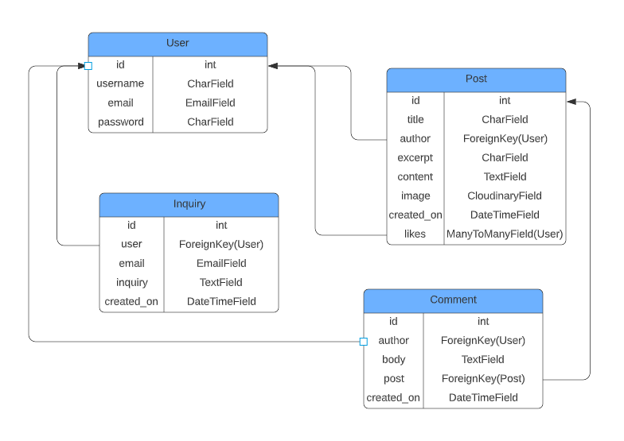

</details>

- #### User Model

  - Provided by the Django framework, each new user is given a unique ID which will serve as FK (Foreign Key) in Post & Comment model.

  - Username, Email and Password is chosen by the user and can be updated from the Profile page.

- #### Post Model

  - ID and time of creation is given automatically. 

  - Users can choose a title, excerpt, content and image, while author is automatically set to the signed in users ID.

  - Likes will be 0 when created, and has a Many to Many relationship with the User model, meaning that many users can like the same post, and the same user can like many posts.

- #### Comment Model

  - ID and time of creation is given automatically.

  - Users can choose a body, while author is automatically set to the signed in users ID.

  - The post field has a FK to the Post model, to make sure the comment is assigned to the correct blog post.

- #### Inquiry Model UPDATE?

  - ID and time of creation is given automatically.

  - Users can choose an email adress and write an inquiry, while user is automatically set to the signed in users ID.

### Wireframes

Wireframes were created using Balsamiq to help the planning process and get an idea of how the site was to be built. The finished site came very close to these mockups, with some minor adjustments.

<details>

<summary>Desktop wireframes</summary>

Home page


About page


Contact page


Register page


Sign in page


Profile page


Sign out page


Delete account page


Create post page


Post detail page


Update post page


Delete post page


</details>

<details>

<summary>Mobile wireframes</summary>

Home page<br>


About page<br>


Contact page<br>


Register page<br>


Sign in page<br>
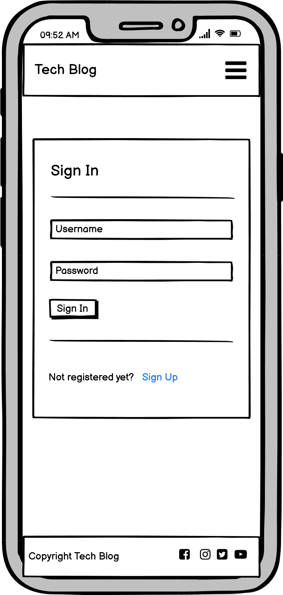

Profile page<br>


Sign out page<br>


Delete account page<br>


Create post page<br>


Post detail page<br>


Update post page<br>


Delete post page<br>


</details>

### Design
- #### Colours

  The colours used on the site are discreet and chosen to put emphasis on the content of blog posts, and not be distracting to the user. The background color is a near white Bootstrap colour (bg-light) that gives contrast to the content on the page, which is wrapped in card-like modules with a clear white background. 
  The navigation bar at the top of the page has a gray Bootstrap colour (bg-secondary) that is also consistently used throughout the application on links and buttons.

  User interactions, such as posting and commenting, or registering and deleting an account all have relevant user feedback. The buttons are coloured in an appropriate way, such as delete buttons being red. Messages giving users feedback are also coloured appropriately to clarify user actions taken.

- #### Typography

  The font used for the site is Poppins, an aesthetically and geometrically pleasing font that suits the content and clean feel of the site. If the font isn't imported correctly, Sans-serif will serve as fallback.

- #### Imagery

  The images on the site are mainly user uploaded post images, with a few exceptions. An image depicting a person overwhelmed with technology is used on the About page, and a generic image of tech gadgets is used as placeholder if a user fails to provide one when creating a post. The main focus should always fall on the content written by the members of the site, therefore no other images were necessary.

## Agile Methodology

To better plan and understand the development process, an agile approach was taken when implementing features. GitHub Projects provides a great way of keeping track of progress made and user stories to develop. By creating a project board on a basic kanban template, the development process can be overviewed and tackled in a proficient and time-effective way. Each user story was first created, assigned to an Epic and added to the project board, then moved to In Progress as the feature was being developed, and finally to Done.

Labels were created and assigned to each user story to help keep track of the importance. 'Must have' labelled user stories have all been finished, 'Should have' labelled user stories were mostly finished, save for one. The 'Could Have' labelled user stories were not implemented due to time constrains, but this labelling system provides a valuable way of ensuring that the most important features gets implemented first.

The distribution of user stories by label are:

- Must have: 60% (12 of 20)

- Should have: 25% (5 of 20)

- Could have: 15% (3 of 20)

When starting the development of each user story, the implementation was broken down into smaller steps that simplified how to tackle the process. For example, when developing the 'create posts' user story, steps like creating the view, rendering the form, handling user errors etc were a great way of managing the development process. This helped keep an organized and agile mindset on how to get the best result within a reasonable timeframe.

This agile approach is especially powerful when working in teams, but still made the development process more enjoyable and easier to keep track of when developing alone.

<details>

<summary>GitHub Project Board</summary>


</details>

## Features

The following section will provide an overview of the features included in Tech Blog. The site consists of several pages, all with a consistent layout and logical paths to take. Some pages can only be accessed by members, while others are accessible to all. All features are fully responsive across all devices.

- ### Navigation Bar

  - Featured at the top of all pages is a nav bar, which holds the logo for the site to the left, as well as navigation links on the right side. 

  - When a new user visits the site, the nav bar will hold an 'Account' option that, when clicked, shows two additional links to either sign in or register.

  - A signed in user will see their username instead which, when clicked, shown links to either create a post, the users profile, or to sign out.

  - When viewed on smaller devices, the navigation links will collapse into a so-called burger icon to help keep the nav bar clean.

  <details>

  <summary>Navigation Bar</summary>

  

  </details>

  <details>

  <summary>Navigation Bar - Signed In</summary>

  

  </details>

  <details>

  <summary>Navigation Bar - Mobile</summary>

  

  </details>

  <details>

  <summary>Navigation Bar - Mobile Dropdown</summary>

  

  </details>

- ### Home Page

  - The home page is the main blog feed where users can browse posts and get an idea of what the posts are about.

  - Each post entry is listed with newest at the top, with a pagination of five posts per page.

  - Information about author, date posted and number of comments and likes is also visible from here.

  <details>

  <summary>Home Page - Desktop</summary>

  

  </details>

  <details>

  <summary>Home Page - Mobile</summary>

  

  </details>

- ### Footer

  - The footer is a simple bar in clear white that breaks off from the near white background to create a subtle and pleasing element at the bottom of the page.

  - To the left is a short copyright text, and on the right side users can find links to different social media plattforms. Since Tech Blog is for educational purposes the links directs the user to the homepage of each plattform respectively.

  <details>

  <summary>Footer - Desktop</summary>

  

  </details>

  <details>

  <summary>Footer - Mobile</summary>

  

  </details>

- ### About Page

  - The about page serves as a short introduction to the blog and what users can expect to find. The text emphasize that everyone is welcome to become members and start sharing their thought with other members, regardless of whether a user is looking for tips, or want to write reviews etc.

  - A link to the contact page can be found here, that lets users send an inquiry to the administration of the site.

  - A fitting image of a guy overwhelmed with tech gadgets helps relate to users.

  <details>

  <summary>About Page - Desktop</summary>

  

  </details>

  <details>

  <summary>About Page - Mobile</summary>

  

  </details>

- ### Contact Page

  - If a user wishes to come in contact with the administraion of the site, they can send an inquiry from the contact page. 

  - The form lets signed in users choose an email for a response, and write an inquiry. An e-mail will then be sent to the admin and the user will receive a copy on the specified e-mail.

  <details>

  <summary>Contact Page - Desktop</summary>

  

  </details>

  <details>

  <summary>Contact Page - Mobile</summary>

  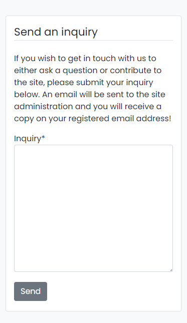

  </details>

- ### Register Page

  - To be able to interact with the site and post content users must register for an account. This page simply lets users choose a username, email and password and saves it to the database.

  - The built in authentication system in Django worked very well for this and if for instance a username is already in use, a message is shown to the user to inform of this.

  - Case insensitive usernames was implemented to improve UX and not having to worry about duplicate usernames.

  - If a user clicks on Register by misstake and already have an account, a link at the bottom takes the user to the sign in page instead.

  <details>

  <summary>Register Page - Desktop</summary>

  

  </details>

  <details>

  <summary>Register Page - Mobile</summary>

  

  </details>

- ### Sign In Page

  - When a user already has an account, they go to the sign in page. Just like on the register page there is a link at the bottom if the user meant to go there.

  <details>

  <summary>Sign In Page - Desktop</summary>

  

  </details>

  <details>

  <summary>Sign In Page - Mobile</summary>

  

  </details>

- ### Profile Page

  - The profile page is accessible for signed in users, and holds the users information with a form to update it if desirable.

  - To prevent users updating their usernames to an already existing name, form handling was implemented similar to the register form.

  - Users can also delete their account from the link at the bottom if they wish, to make sure no info is stored on them. If clicked, the user is taken to a confirmation screen to make sure an account is not deleted by accident.

  <details>

  <summary>Profile Page - Desktop</summary>

  

  </details>

  <details>

  <summary>Profile Page - Mobile</summary>

  

  </details>

  <details>

  <summary>Profile Page - Delete Account</summary>

  

  </details>

- ### Sign Out Page

  - When a user clicks the sign out link a page with a message stating they have been signed out is shown. 
  
  - Two links, to the home page and back to the sign in page can also be found.

  <details>

  <summary>Sign Out Page - Desktop</summary>

  

  </details>

  <details>

  <summary>Sign Out Page - Mobile</summary>

  

  </details>

- ### Create Post Page

  - Signed in users can access this page from the nav bar, and from here they can create post entries by filling out a form.

  - Users choose a title, excerpt, content and an image for their post, while ID, author and time of creation is given automatically.

  - If the user don't upload an image for their post, a generic placeholder image is provided for them.

  <details>

  <summary>Create Post Page - Desktop</summary>

  

  </details>

  <details>

  <summary>Create Post Page - Mobile</summary>

  

  </details>

- ### Post Detail Page

  - When user creates or clicks on a post from the home page, the post detail page is shown, with the full content of the post, along with any comments that has been left by users on the post.

  - There is a like button that users can toggle to like / unlike posts and show appreciation to fellow members. 

  - If the author of the post visits the page, there are buttons for updating the post, as well as deleting it.

  - If a user leaves a comment and later wants to delete it, there is a small button on the comments written by the signed in user to delete their own comments. This will trigger a modal to ask for confirmation to prevent accidental deletion.

  <details>

  <summary>Post Detail Page - Desktop</summary>

  

  </details>

  <details>

  <summary>Liked & Authors Post - Desktop</summary>

  

  </details>

  <details>

  <summary>Authors Post - Mobile</summary>

  

  </details>

  <details>

  <summary>Liked Post - Mobile</summary>

  

  </details>

  <details>

  <summary>Delete Comment</summary>

  

  </details>

- ### Update Post

  - If the author of a post wishes to edit or update their post, they click the button on the detail page and a form for updating it is shown.

  - All fields are prepopulated with the existing data to simplify the process for the user.

  - If the user wishes to go back without saving any changes, they can simply click the 'Go back' link at the bottom.

  <details>

  <summary>Update Post Page - Desktop</summary>

  

  </details>

  <details>

  <summary>Update Post Page - Mobile</summary>

  

  </details>

- ### Delete Post Page

  - If the author of a post wishes to delete it, they click the button on the detail page and a confirmation page is shown.

  - If the user wishes to go back without deleting the post, they can simply click the 'Keep the post' link at the bottom.

  <details>

  <summary>Delete Post Page - Desktop</summary>

  

  </details>

  <details>

  <summary>Delete Post Page - Mobile</summary>

  

  </details>

- ### Messages

  - To keep users informed, simple message flashes will be displayed on various user interactions, such as creating a post, registering an account etc. These will only be visible a few seconds before dissapearing by themself, to not interfere with the UX.

  <details>

  <summary>Create Account Message</summary>

  

  </details>

  <details>

  <summary>Create Post Message</summary>

  

  </details>

  <details>

  <summary>Delete Post Message</summary>

  

  </details>

### Features Left to Implement

- Password reset through the registered e-mail, if the user forgets their password.

- See a list of the users own posts, to easier manage their own content.

- A nicer format for writing the body of post entries, like a rich text editor.

- Search function to find a certain post or posts about a certain topic.

- Automatically resize images uploaded by users to improve site performance.

- Visit other members profile pages and see a list of their posts.

## Testing
### Code Validation

To ensure all code for Tech Blog is correct, validation through various validators was performed. The results are listed below.

- ### HTML Validation

  All HTML code was checked with the [W3C Markup Validator](https://validator.w3.org/). One error was found on the Register page, which was attributed to code provided by the built in authentication system of Django, and could therefore not be addressed. No other error or warnings were found.

  <details>

  <summary>Home Page</summary>

  

  </details>

  <details>

  <summary>About Page</summary>

  

  </details>

  <details>

  <summary>Contact Page</summary>

  

  </details>

  <details>

  <summary>Register Page</summary>

  

  </details>

  <details>

  <summary>Sign In Page</summary>

  

  </details>

  <details>

  <summary>Profile Page</summary>

  

  </details>

  <details>

  <summary>Sign Out Page</summary>

  

  </details>

  <details>

  <summary>Delete Account Page</summary>

  

  </details>

  <details>

  <summary>Create Post Page</summary>

  

  </details>

  <details>

  <summary>Post Detail Page</summary>

  

  </details>

  <details>

  <summary>Post Update Page</summary>

  

  </details>

  <details>

  <summary>Post Delete Page</summary>

  

  </details>

- ### CSS Validation

  All CSS code was checked with the [W3C CSS Validator](https://jigsaw.w3.org/css-validator/). No errors or warnings were found.

  <details>

  <summary>CSS code Results</summary>

  

  </details>

- ### JavaScript Validation

  All JavaScript code was checked with the [JSHint Code Quality Tool](https://jshint.com/). No errors or warnings were found.

  <details>

  <summary>JavaScript code Results</summary>

  

  </details>

- ### Python Validation

  All Python code was checked with the [PEP8 Online Validator](http://pep8online.com/). No errors or warnings were found.

  <details>

  <summary>Blog App admin.py</summary>

  

  </details>

  <details>

  <summary>Blog App apps.py</summary>

  

  </details>

  <details>

  <summary>Blog App forms.py</summary>

  

  </details>

  <details>

  <summary>Blog App models.py</summary>

  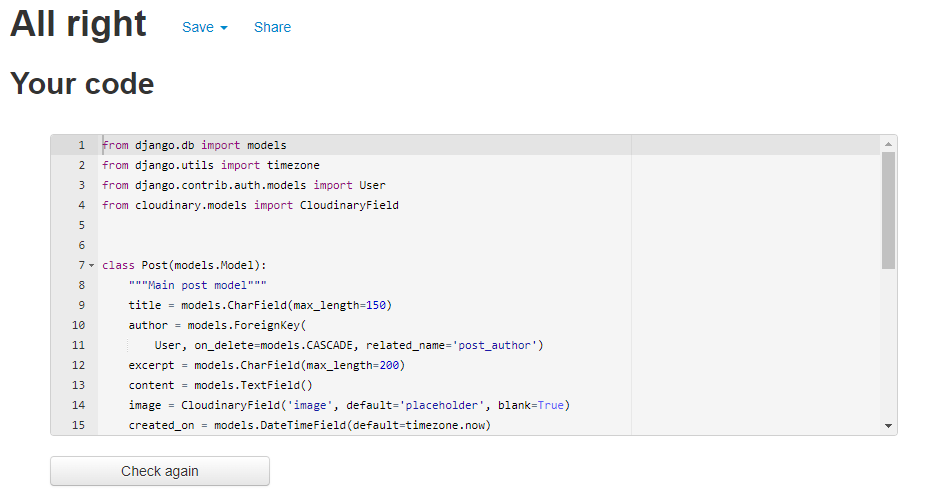

  </details>

  <details>

  <summary>Blog App urls.py</summary>

  

  </details>

  <details>

  <summary>Blog App views.py</summary>

  

  </details>

  <details>

  <summary>Blog App test_forms.py</summary>

  

  </details>

  <details>

  <summary>Blog App test_models.py</summary>

  

  </details>

  <details>

  <summary>Blog App test_urls.py</summary>

  

  </details>

  <details>

  <summary>Blog App test_views.py</summary>

  

  </details>

  <details>

  <summary>Users App apps.py</summary>

  

  </details>

  <details>

  <summary>Users App backends.py</summary>

  

  </details>

  <details>

  <summary>Users App forms.py</summary>

  

  </details>

  <details>

  <summary>Users App models.py</summary>

  

  </details>

  <details>

  <summary>Users App urls.py</summary>

  

  </details>

  <details>

  <summary>Users App views.py</summary>

  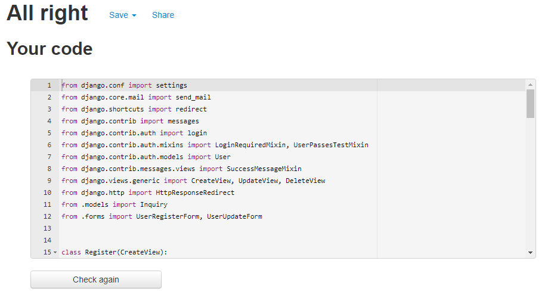

  </details>

  <details>

  <summary>Users App test_forms.py</summary>

  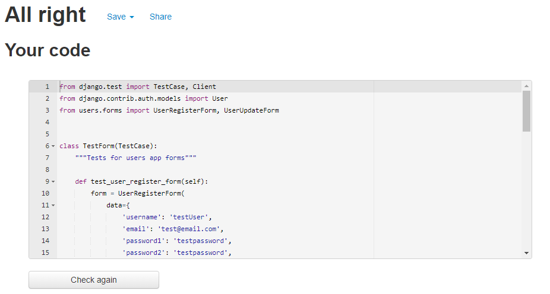

  </details>

  <details>

  <summary>Users App test_urls.py</summary>

  

  </details>

  <details>

  <summary>Users App test_views.py</summary>

  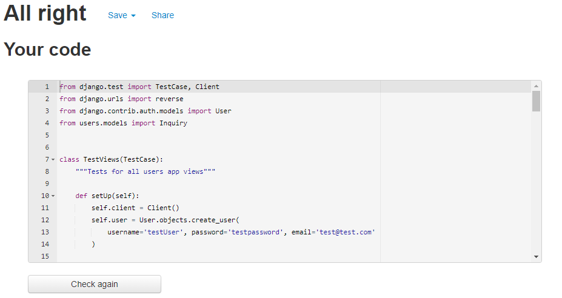

  </details>

### Responsive Testing

- You can open DevTools with keyboard shortcuts (CMD+Opt+I for Mac OS or Ctrl+Shift+I for Linux and Windows), through the menu bar in the top right corner and go to "More Tools" > "Developer Tools." or by right-clicking on any web page and select "Inspect". To test responsiveness, click on the "device" icon on the left side, above the source code window or with the keyboard shortcut CMD+Shift+M for Mac OS or Ctrl+Shift+M for Linux and Windows. Under "Dimensions" you can choose between different devices to emulate, or you can drag the handles to resize the window to your preferred screen width by choosing "Responsive".

- To test the responsiveness of the website multiple devices were used to browse and create posts, register accounts etc including a Desktop, Laptop, iPad Air, Samsung Galaxy S20, iPhone 12, iPhone X, and iPhone 8. The site was also tested on different browsers, such as Chrome, Edge, Safari and Firefox.

- Using Chrome DevTools, the site was optimized for all screen widths down to at least 260px.

### Lighthouse Testing

- The Lighthouse tool in Chrome DevTools was used to test the sites performance, accessibility, best practices and SEO. The website performed well in the tests, indicating a well-structured, highly accessible site.

- A console error that seems to originate from some Bootstrap JavaScript code was caught by the Lighthouse tool. The error had to do with the alert function to display various messages to the user. Since the code was not written by the developer it could not be adressed. This had a slight impact on the "best practices" test but was not substantial enough to raise any real concern.

  <details>

  <summary>Lighthouse - About Page - Desktop</summary>

  

  </details>

  <details>

  <summary>Lighthouse - About Page - Mobile</summary>

  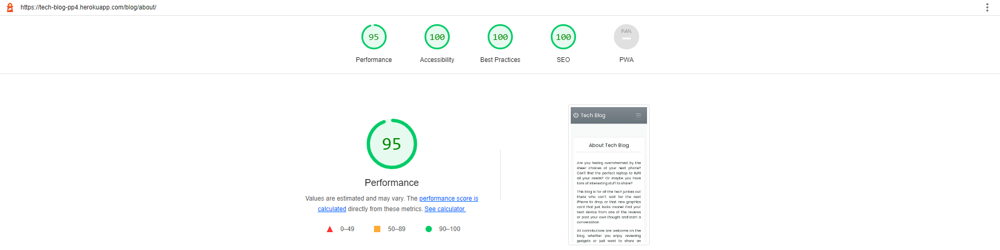

  </details>

  <details>

  <summary>Lighthouse - Contact Page - Desktop</summary>

  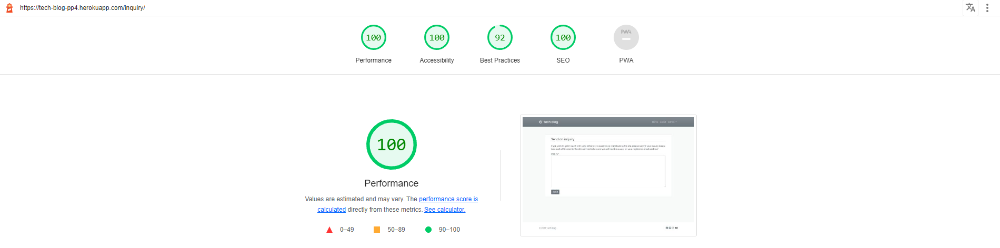

  </details>

  <details>

  <summary>Lighthouse - Contact Page - Mobile</summary>

  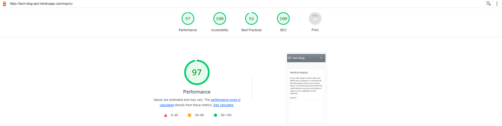

  </details>

  <details>

  <summary>Lighthouse - Create Post Page - Desktop</summary>

  

  </details>

  <details>

  <summary>Lighthouse - Create Post Page - Mobile</summary>

  

  </details>

  <details>

  <summary>Lighthouse - Delete Account Page - Desktop</summary>

  

  </details>

  <details>

  <summary>Lighthouse - Delete Account Page - Mobile</summary>

  

  </details>

  <details>

  <summary>Lighthouse - Delete Post Page - Desktop</summary>

  

  </details>

  <details>

  <summary>Lighthouse - Delete Post Page - Mobile</summary>

  

  </details>

  <details>

  <summary>Lighthouse - Home Page - Desktop</summary>

  

  </details>

  <details>

  <summary>Lighthouse - Home Page - Mobile</summary>

  

  </details>

  <details>

  <summary>Lighthouse - Post Detail Page - Desktop</summary>

  

  </details>

  <details>

  <summary>Lighthouse - Post Detail Page - Mobile</summary>

  

  </details>

  <details>

  <summary>Lighthouse - Profile Page - Desktop</summary>

  

  </details>

  <details>

  <summary>Lighthouse - Profile Page - Mobile</summary>

  

  </details>

  <details>

  <summary>Lighthouse - Register Page - Desktop</summary>

  

  </details>

  <details>

  <summary>Lighthouse - Register Page - Mobile</summary>

  

  </details>

  <details>

  <summary>Lighthouse - Sign In Page - Desktop</summary>

  

  </details>

  <details>

  <summary>Lighthouse - Sign In Page - Mobile</summary>

  

  </details>

  <details>

  <summary>Lighthouse - Sign Out Page - Desktop</summary>

  

  </details>

  <details>

  <summary>Lighthouse - Sign Out Page - Mobile</summary>

  

  </details>

  <details>

  <summary>Lighthouse - Update Post Page - Desktop</summary>

  

  </details>

  <details>

  <summary>Lighthouse - Update Post Page - Mobile</summary>

  

  </details>

### Manual Testing

To make sure all interactions and forms / links work as intended, manual testing was performed.

| Status | Home Page / Navigation Bar |
|:------:| -------------------------- |
| &check; | Clicking logo loads homepage |
| &check; | Clicking Home loads homepage |
| &check; | Clicking About loads about page |
| &check; | Clicking Sign In loads sign in page |
| &check; | Clicking Register In loads register page |
| &check; | Clicking Create Post loads post creation page (signed in) |
| &check; | Clicking Profile loads profile page (signed in) |
| &check; | Clicking Sign Out signs user out and loads sign out page (signed in) |
| &check; | Clicking a post image or 'Visit Post' loads post detail page |
| &check; | Clicking pagination buttons loads next / previous page |
| &check; | Clicking social media links in footer opens in new tab |

| Status | About Page |
|:------:| ---------- |
| &check; | Clicking Send us an inquiry! loads contact page (signed in) |
| &check; | Clicking Send us an inquiry! redirects to sign in page (signed out) |
| &check; | After signin in, redirects back to contact page (signed in) |

| Status | Contact Page |
|:------:| ------------ |
| &check; | Filling out form incorrectly gives error message (signed in) |
| &check; | Filling out form correctly saves inquiry and redirects to home page (signed in) |
| &check; | Filling out form correctly automatically sends an email to site admin & the user (signed in) |

| Status | Create Post Page |
|:------:| ---------------- |
| &check; | Filling out form incorrectly gives error message (signed in) |
| &check; | Uploading unsupported image format gives error message (signed in) |
| &check; | Filling out form correctly saves post and redirects to post detail page (signed in) |
| &check; | Not providing an image is accepted, placeholder is provided instead (signed in) |

| Status | Post Detail Page |
|:------:| ---------------- |
| &check; | Clicking like icon toggles like / unlike (signed in) |
| &check; | Clicking Update post loads post update page (signed in, author) |
| &check; | Clicking Delete post loads confirm delete page (signed in, author) |
| &check; | Posting a comment reloads page and saves the comment (signed in) |
| &check; | Clicking Delete comment loads confirm delete modal (signed in, author of comment) |
| &check; | Confirming delete comment deletes it completely (signed in, author of comment) |

| Status | Update Post Page |
|:------:| ---------------- |
| &check; | All fields are prepopulated with previous data (signed in, author) |
| &check; | Filling out form incorrectly gives error message (signed in, author) |
| &check; | Uploading unsupported image format gives error message (signed in, author) |
| &check; | Filling out form correctly saves post and redirects to post detail page (signed in, author) |
| &check; | Not providing an image is accepted, placeholder is provided instead (signed in, author) |
| &check; | Clicking Go back takes user back to post detail page (signed in, author) |

| Status | Delete Post Page |
|:------:| ---------------- |
| &check; | Clicking Delete button deletes the post completely and redirects to home (signed in, author) |
| &check; | Clicking Keep the post takes user back to post detail page (signed in, author) |

| Status | Sign In Page |
|:------:| ------------ |
| &check; | Filling out form incorrectly gives error message |
| &check; | Signin in with valid credentials authenticates user and loads home page |
| &check; | Clicking Sign Up loads register page |

| Status | Register Page |
|:------:| ------------- |
| &check; | Filling out form incorrectly gives error message |
| &check; | Registering with valid credentials authenticates user and loads home page |
| &check; | Clicking Sign In loads sign in page |

| Status | Profile Page |
|:------:| ------------ |
| &check; | All fields are prepopulated with previous data (signed in) |
| &check; | Filling out form incorrectly gives error message (signed in) |
| &check; | Updating user info and clicking Update saves new data (signed in) |
| &check; | Clicking Delete account loads confirm delete page (signed in) |

| Status | Delete Account Page |
|:------:| ------------------- |
| &check; | Clicking Delete button deletes the user completely and redirects to home (signed in) |
| &check; | Clicking Keep my account takes user back to profile page (signed in) |

| Status | Sign Out Page |
|:------:| ------------- |
| &check; | Clicking Back to home page loads home page |
| &check; | Clicking Sign In loads sign in page |

| Status | Error Pages |
|:------:| ----------- |
| &check; | Loads 404 page when a user gives an invalid url |
| &check; | Loads 403 page when a user tries to access a restricted url |
| &check; | Loads 500 page when an error occurs |
| &check; | Clicking Take me back to safety! loads home page |

### User Story Implementation UPDATE?

- #### Site Admin

  - As a Site Admin I can manage the post content on the blog so that I can make sure no objectionable posts are present.

    - Implemented as intended.

  - As a Site Admin I can manage the comments on the blog posts so that I can make sure no objectionable comments are present.

    - Implemented as intended.

  - As a Site Admin I can receive user inquiries on both the admin page and through email so that I can communicate with the site users.

    - Implemented as intended.

- #### User Registration

  - As a Site User I can register an account so that I can make posts and comments.

    - Implemented as intended.

  - As a Site User I can update my information so that I can personalize my profile.

    - Implemented as intended. 

  - As a Site User I can delete my profile so that there is no stored info on me.

    - Implemented as intended.

- #### User Navigation

  - As a Site User I can view a paginated list of posts so that I can easily select a post to view.

    - Implemented as intended.

  - As a Site User I can click on a post so that I can read the full text.

    - Implemented as intended.

  - As a Site User I can view how many likes a post have so that I can see which posts are popular.

    - Implemented as intended.

  - As a Site User I can view comments on a post so that I can read what other users think.

    - Implemented as intended.

- #### User Interaction

  - As a Site User I can like / unlike a post so that I can interact with the content and show appreciation.

    - Implemented as intended.

  - As a Site User I can create posts so that I can provide content to the community.

    - Implemented as intended.

  - As a Site User I can edit or delete my own posts so that I can control my own content.

    - Implemented as intended.

  - As a Site User I can leave comments on a post so that I can join in the conversation.

    - Implemented as intended.

  - As a Site User I can delete my own comments so that I can control my own content.

    - Implemented as intended.

  - As a Site User I can contact the administration of the blog so that I can ask questions or help with the blog.

    - Implemented as intended.

#### User Stories Not Implemented

- #### User Registration

  - As a Site User I can reset my password using my registered e-mail so that I can gain access to my account if I forget my password.

    - Unfortunately not implemented due to time constraints. After getting feedback on the site this is the most prioritized feature to implement when time permits.

- #### User Navigation

  - As a Site User I can view a list of my own posts so that I can see my content and have easy access to it.

    - Unfortunately not implemented due to time constraints. Planned to be implemented in the future.

  - As a Site User I can visit other members profile pages so that I can see their information and a list of their posts.

    - Unfortunately not implemented due to time constraints. Planned to be implemented in the future.

  - As a Site User I can search among the posts so that I can find a certain post or posts about a certain topic.

    - Unfortunately not implemented due to time constraints. Planned to be implemented in the future.

### Automated Testing

Using Django TestCase extensive python testing was performed, which helped show the benefits of writing tests for code. For this project a Minimum Viable Product was prioritized, therefore the application was built before the tests were written. After getting acquainted with testing python code on this project, a test-driven development will be adopted for future projects.

46 tests were written to test as much of the code as possible. The result is presented below.

<details>

<summary>Unittest - Test Results</summary>


</details>

As a way of revealing the coverage of the tests, the coverage package was used to measure a 97% coverage result.

<details>

<summary>Unittest - Coverage Results</summary>

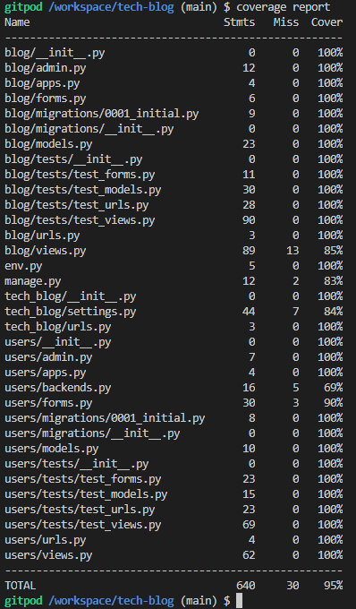

</details>

### Fixed Bugs

- When implementing the authentication system, a security flaw was detected where signed in users could access other users profiles and edit / delete them.

  - **Solution:** A mixin called 'UserPassesTestMixin' was added to the profile and DeleteUser views. A test_func could then check to make sure that the request was made by the signed in user. This was then kept in mind when developing the remaining features of the site.

- If a user would upload an unsupported file format for their post image, an error would occur and crash the application.

  - **Solution:** The PostCreate and PostUpdate view were modified with a try / except block to handle errors and show a message to the user to upload a valid image format.

- A comment with only spaces would throw a server error code 500.

  - **Solution:** A missed else statement in the 'if form.is_valid()' led to the error not being handled. After implementing the else statement a message will tell the user to not submit the form empty (spaces only).

- After implementing case insensitive usernames to help with UX, users could update to or register with the same username but with different capitalization. For example if one user named 'john' and another named 'John' registered, then as one of them tried to sign in, the application would crash since the sign in method would return more than one user.

  - **Solution:** By adding a method to the UserRegisterForm and UserUpdateForm to check if username existed in any casing the issue was solved. When a user tries to update to or register with an existing username but different capitalizaion a message will tell the user that it already exists.

### Known/Unfixed Bugs

- As of writing this readme, no known bugs remain unfixed.

## Technologies Used
### Languages

- [HTML5](https://en.wikipedia.org/wiki/HTML5)

- [CSS3](https://en.wikipedia.org/wiki/CSS)

- [JavaScript](https://www.javascript.com/)

- [Python](https://www.python.org/)

### Python Packages

- All packages used on the application can be found in the [requirements.txt](https://github.com/LucasBehrendt/tech-blog/blob/main/requirements.txt) file.

### Programs & Libraries

- [Balsamiq](https://balsamiq.com/) - The wireframes used for the site was created with Balsamiq.

- [Bootstrap](https://getbootstrap.com/) -  A CSS framework used for styling and making the site responsive.

- [Chrome DevTools](https://developer.chrome.com/docs/devtools/) - A powerful tool used throughout the creation of the website.

- [Cloudinary](https://cloudinary.com/) - Used to host the images uploaded by users on the site.

- [Django](https://www.djangoproject.com/) - A python-based batteries-included framework used to create the site.

- [Favicon](https://favicon.io/) - The favicon visible in the websites tab was generated with this site.

- [Font Awesome](https://fontawesome.com/) - The icons in the site were provided by Font Awesome.

- [Git](https://git-scm.com/) - Git was used through the Gitpod terminal as version control to commit and push to GitHub.

- [GitHub](https://github.com/) - All code for the site is stored on GitHub after being pushed from Git.

- [Google Fonts](https://fonts.google.com/) - The font used on the site was imported from Google Fonts.

- [Heroku](https://www.heroku.com) - Used for hosting the site.

- [JSHint](https://jshint.com/) - Validation of JavaScript code was done with JSHint.

- [Lucidchart](https://www.lucidchart.com/pages/) - The flowchart & ERD created for the site was made with Lucidchart.

- [PEP8 Online Validator](http://pep8online.com/) - Validation of Python code was done with PEP8 Online.

- [Pexels](https://www.pexels.com/) -  All images were provided by Pexels.

- [PostGreSQL](https://www.postgresql.org/) - Used through Heroku as database for the application.

- [Techsini](http://techsini.com/multi-mockup/index.php) - The responsive image at the top of the README came from Techsini.

- [W3C](https://www.w3.org/) - Validation of HTML and CSS code was done with W3C.

## Deployment

The site was deployed using Heroku. The steps for the deployment process are:

### 1. Create a repository in GitHub and clone to a local machine

  - If you are using the same template as for this project it can be found [here](https://github.com/Code-Institute-Org/gitpod-full-template). Click 'Use this template' and create your own repository.

  - If you wish to clone this project, clone it from [here](https://github.com/LucasBehrendt/tech-blog) and follow the instructions below.

  - Navigate to the main page of the repository you wish to clone.

  - Above the list of files, click the "code" button.

  - To clone the repository using HTTPS, under "clone with HTTPS", copy the URL provided.

  - Open Git Bash.

  - Change the current working directory to the location where you want the cloned directory.

  - Type `git clone`, and then paste the URL you copied earlier.
    ```
    $ git clone https://github.com/YOUR-USERNAME/YOUR-REPOSITORY
    ```

  - Press Enter to create your local clone.
    ```
    $ git clone https://github.com/YOUR-USERNAME/YOUR-REPOSITORY
    > Cloning into `Clone-dir`...
    > remote: Counting objects: 10, done.
    > remote: Compressing objects: 100% (8/8), done.
    > remove: Total 10 (delta 1), reused 10 (delta 1)
    > Unpacking objects: 100% (10/10), done.
    ```

  - For a more detailed explanation, see this [walkthrough](https://docs.github.com/en/repositories/creating-and-managing-repositories/cloning-a-repository).

### 2. Set up a virtual environment

  - Open the project in your local code editor.

  - Install virtualenv:
    ```
    $ pip install virtualenv
    ```

  - Create a virtual environment:
    ```
    $ virtualenv env_name
    ```

  - Activate the virtual environment:
    ```
    $ source env_name/bin/activate
    ```

### 3. Install packages and libraries

  - If you are cloning this project you can easily install all packages/libraries required:
    ```
    $ pip install -r requirements.txt
    ```
  - Otherwise install the following packages/libraries:
    ```
    $ pip install django3.2
    ```
    ```
    $ pip install gunicorn
    ```
    ```
    $ pip install dj_database_url psycopg2
    ```
    ```
    $ pip install dj3-cloudinary-storage
    ```
  - Create a requirements.txt file:
    ```
    $ pip freeze --local > requirements.txt
    ```

### 4. Create Django project

  - Create a new django project:
    ```
    $ django-admin startproject project_name .
    ```
  - Create an app within the project:
    ```
    $ python manage.py startapp app_name
    ```
  - Add the new app 'app_name' to the bottom of INSTALLED_APPS in your projects settings.py file.

  - Migrate changes:
    ```
    $ python manage.py migrate
    ```
  - Test that the project works on you localhost:
    ```
    $ python manage.py runserver
    ```

### 5. Create an app on Heroku

  - Sign in or create an account if you don't have one on [Heroku](https://www.heroku.com/)

  - On your dashboard, click the 'New' button in the to right corner and select 'Create new app'.

  - Name the project and set the region to the relevant one, then click the 'Create app' button.

  - When the app has been created, go to the 'Resources' tab. Search for 'Heroku Postgres' and select 'Hobby Dev - Free' as plan, then click 'Submit Order Form'.

### 6. Set up environment variables

  - In your projects root directory, create a file called env.py and add it to your .gitignore file to keep it from being tracked by version control.

  - Under the settings tab on your heroku app, scroll down to 'Config Vars' and click on 'Reveal Config Vars'. Copy the 'DATABASE_URL' value.

  - In env.py, import os and set the following environment variables:
    ```
    os.environ["DATABASE_URL"] = "Paste in Heroku DATABASE_URL value"
    ```
    ```
    os.environ["SECRET_KEY"] = "Make up your own randomSecretKey"
    ```

  - In your Heroku Config Vars, add the key SECRET_KEY with your randomSecretKey value.

  - Sign in or create an account on [Cloudinary](https://cloudinary.com/) and copy your API variable. Set the environment variable in env.py:
    ```
    os.environ["CLOUDINARY_URL"] = "cloudinary://************************"
    ```

  - In your Heroku Config Vars, add the key CLOUDINARY_URL with your cloudinary api url value.

  - Set one more Heroku Config Var name DISABLE_COLLECTSTATIC with the value of 1. This is a temporary variable to be able to deploy to heroku without any static files.

  - The last environment variable to set in env.py is to make sure DEBUG is set to True when running the server locally, but when deployed to Heroku it will be set to False:
    ```
    os.environ["DEVELOPMENT"] = "True" 
    ``` 
    - Make sure to NOT set this variable in you Heroku Config Vars!
    
### 7. Update settings.py File

  - Near the top of the settings.py file, below `from pathlib import Path` add the following imports:
    ```
    import os
    import dj_database_url
    if os.path.isfile('env.py'):
        import env
    ```

  - Create a 'development' variable and set it to:
    ```
    development = os.environ.get('DEVELOPMENT', False)
    ```

  - Set DEBUG to the development variable so that, if running locally, the parsed value from your env.py file will set DEBUG to True. On Heroku, it will be set to False:
    ```
    DEBUG = development
    ```

  - Replace the default SECRET_KEY with the key you created in your env.py file:
    ```
    SECRET_KEY = os.environ.get('SECRET_KEY')
    ```

  - Add Cloudinary packages to INSTALLED_APPS above your apps name, in the following order (important):
    ```
    INSTALLED_APPS = [
        ..., 
        'cloudinary_storage',
        'django.contrib.staticfiles',
        'cloudinary',
        'app_name',
    ]
    ```

  - To use the Heroku PostGreSQL database, replace the default value of the DATABASES variable with:
    ```
    DATABASES = {
        'default': dj_database_url.parse(os.environ.get('DATABASE_URL'))
    }
    ```

  - Below the comments referencing static files, add the following snippet to use cloudinary for static files:
    ```
    # Static files (CSS, JavaScript, Images)
    # https://docs.djangoproject.com/en/3.2/howto/static-files/
    STATIC_URL = '/static/'
    STATICFILES_STORAGE = 'cloudinary_storage.storage.StaticHashedCloudinaryStorage'
    STATICFILES_DIRS = (os.path.join(BASE_DIR, 'static'),)
    STATIC_ROOT = os.path.join(BASE_DIR, 'staticfiles')

    MEDIA_URL = '/media/'
    DEFAULT_FILE_STORAGE = 'cloudinary_storage.storage.MediaCloudinaryStorage'
    ```

  - Below the imports at the top of the file, just under the BASE_DIR variable, add the following:
    ```
    TEMPLATES_DIR = os.path.join(BASE_DIR, 'templates')
    ```

  - To use this TEMPLATES_DIR setting, add it to the 'DIRS' key in the TEMPLATES dict:
    ```
    TEMPLATES = [
        {
            'BACKEND': 'django.template.backends.django.DjangoTemplates',
            'DIRS': [TEMPLATES_DIR],
            'APP_DIRS': True,
            'OPTIONS': {
                'context_processors': [
                    'django.template.context_processors.debug',
                    'django.template.context_processors.request',
                    'django.contrib.auth.context_processors.auth',
                    'django.contrib.messages.context_processors.messages',
                ],
            },
        },
    ]
    ```

  - Add both the Heroku host and your localhost to the ALLOWED_HOSTS list close to the top of the file:
    ```
    ALLOWED_HOSTS = ['project_name.herokuapp.com', 'localhost']
    ```

  - Create the following file and folders in the root directory of your project:

    - 'media' (folder)
    - 'static' (folder)
    - 'templates' (folder)
    - 'Procfile' (file)

  - Within the Procfile, add the following line:
    ```
    web: gunicorn project_name.wsgi
    ```

  - Since the PostGreSQL database is now being used, migrate the changes again:
    ```
    $ python manage.py migrate
    ```

  - Make sure all files are saved, then commit and push to GitHub:
    ```
    $ git add .
    ```
    ```
    $ git commit -m "Deployment commit"
    ```
    ```
    $ git push
    ```

### 8. Deploy to Heroku

  - Navigate to the Deploy tab on Heroku and under Deployment method, connect to your GitHub account.

  - Directly below Deployment method there is a search bar to search for your repository. Connect the correct one to Heroku by clicking the Connect button.

  - Scroll down to Manual deploy and click Deploy Branch, making sure that the main branch is selected.

  - To enable automatic updates to the project, simply scroll up to Automatic deploys and click the Enable Automatic Deploys button.

  - Your project is now hosted on Heroku.

If you wish to deploy to Heroku using the CLI, follow these steps instead:

  - Login to heroku by entering your credentials:
    ```
    $ heroku login -i
    ```

  - Find your app name from your account:
    ```
    $ heroku apps
    ```

  - Add Heroku remote:
    ```
    $ heroku git:remote -a app_name
    ```

  - Push to heroku
    ```
    $ git push heroku main
    ```

The live link to this project can be found [here](https://tech-blog-pp4.herokuapp.com/).

## Credits
### Code

- [Stackoverflow](https://stackoverflow.com/) almost always have an answer to your questions. 

  - [This](https://stackoverflow.com/questions/59176246/) post helped with how to render foreign key data from a model to an HTML template. 
  
  - When creating a DeleteView in Django, [this](https://stackoverflow.com/questions/24822509/) post helped with displaying a success message.

  - Implementing case insensitive usernames was managed with the help of [this](https://stackoverflow.com/questions/70713647/) post.

- Corey Schafer is a youtuber and a great developer that made a series on developing a Django project. [This playlist](https://www.youtube.com/watch?v=UmljXZIypDc&list=PL-osiE80TeTtoQCKZ03TU5fNfx2UY6U4p) helped when implementing some features on this project.

- [The Django documentation](https://docs.djangoproject.com/en/3.2/) was crucial to the development of this project, and a constant go-to for help with all code written.

- [The Bootstrap documentation](https://getbootstrap.com/docs/5.1/getting-started/introduction/) was also a big help when creating the front end with the Bootstrap framework.

- [Start Bootstrap](https://startbootstrap.com/) had some great front-end templates which was modified to fit the site.

  - [Start Bootstrap Navbar](https://startbootstrap.com/snippets/navbar-logo)

  - [Start Bootstrap Blog Feed](https://startbootstrap.com/snippets/portfolio-one-column)

- [This youtube series](https://www.youtube.com/watch?v=qwypH3YvMKc&list=PLbpAWbHbi5rMF2j5n6imm0enrSD9eQUaM) was a great inspiration for how to write automated tests in Django.

- [This article](https://simpleisbetterthancomplex.com/tutorial/2017/02/06/how-to-implement-case-insensitive-username.html) helped immensely when dealing with the bug of having duplicate usernames.

- Code Institute Tutor Support helped with solving some issues, including how to properly set up an automated e-mail when a user contacts the site admin and how to properly handle if a user uploads an unsupported image format.

- The Code Institute Django Blog walkthrough project had some great features that helped with the development of this project.

### Content

- The font used in the site was imported from [Google Fonts](https://fonts.google.com/).

- All text content was written by the developer.

- Blog post images and content are written mostly by friends and family.

### Media

- Icons used in the site were taken from [Font Awesome](https://fontawesome.com/).

- The favicon was generated with [Favicon.io](https://favicon.io/).

- All images used were provided by [Pexels](https://www.pexels.com/).

### Acknowledgements

- My mentor Brian for some great feedback along the way, and some good ideas on how to make the project better.

- Code Institutes Tutor Support, for always being helpful and professional.

[Back to top](#tech-blog)