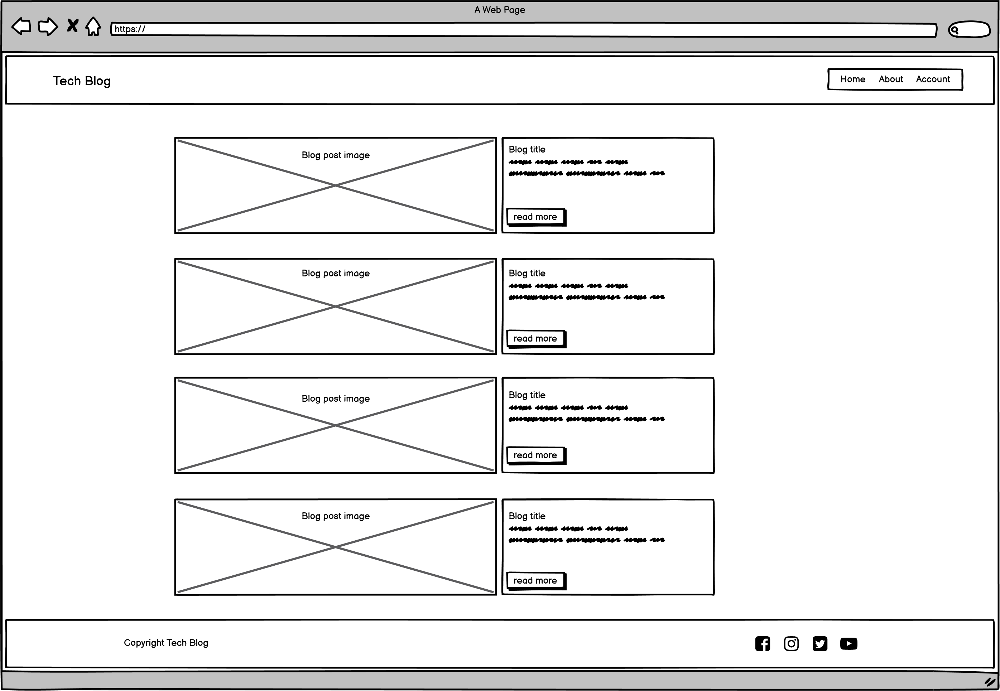
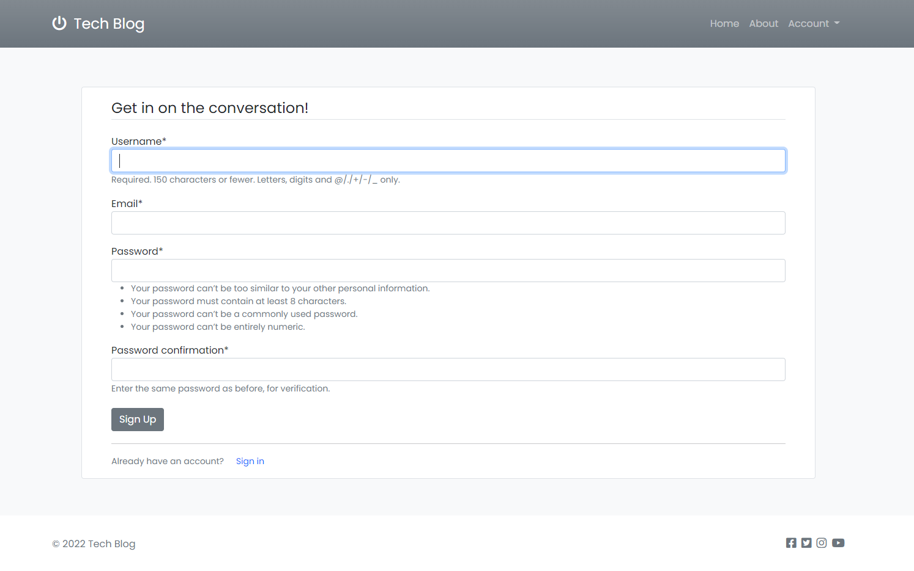
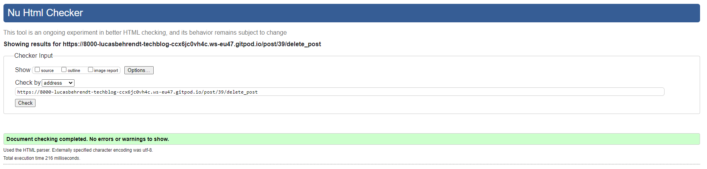

# Tech Blog

Tech Blog is an open community-driven site for everyone, whether you're a tech geek that can't get enough of the newest and hottest gadgets on the market, or just looking for some tips on your next purchase. By signin up, users can share their thoughts and interact with other members by commenting on and liking posts.

The main objective of this project is to demonstrate a robust Full Stack application with strong competency in both front-end and back-end development, using the Django framework.

[Find the live website here!](https://tech-blog-pp4.herokuapp.com/)

# Table of Contents

## User Experience (UX)
### User Stories

The following user stories were used in an agile approach when creating the application, implemented in order of importance. 

- #### Site Admin

  - As a Site Admin I can manage the post content on the blog so that I can make sure no objectionable posts are present.

  - As a Site Admin I can manage the comments on the blog posts so that I can make sure no objectionable comments are present.

- #### User Registration

  - As a Site User I can register an account so that I can make posts and comments.

  - As a Site User I can update my information so that I can personalize my profile.

  - As a Site User I can delete my profile so that there is no stored info on me.

- #### User Navigation

  - As a Site User I can view a paginated list of posts so that I can easily select a post to view.

  - As a Site User I can click on a post so that I can read the full text.

  - As a Site User I can view how many likes a post have so that I can see which posts are popular.

  - As a Site User I can view comments on a post so that I can read what other users think.

  - As a Site User I can view a list of my own posts so that I can see my content and have easy access to it.

- #### User Interaction

  - As a Site User I can like / unlike a post so that I can interact with the content and show appreciation.

  - As a Site User I can create posts so that I can provide content to the community.

  - As a Site User I can edit or delete my own posts so that I can control my own content.

  - As a Site User I can leave comments on a post so that I can join in the conversation.

  - As a Site User I can delete my own comments so that I can control my own content.

### Structure

The site is structured with simplicity and accessibility in mind, to help users intuitively navigate the site. The landing page gives the user relevant information about each post without cluttering the feed. A simple, fully responsive navigation helps keep the flow of the site balanced when navigating and interacting with the application. All pages are carefully structured to be consistent and pleasing to browse. All user interactions, such as registering an account or creating a post have logical responses and provide relevant feedback.

To help facilitate a logical flow of the application during the development process, a simple flowchart was created using [Lucidchart](https://www.lucidchart.com/pages/).

Flowchart

### Data Model

The database used for the application requires a Post and Comment model. The user authentication system is included in the Django framework and a User model was therefore already provided. To get an idea of the relationships and fields required in the models, an ERD (Entity Relationship Diagram) was created using [Lucidchart](https://www.lucidchart.com/pages/).

Entity Relationship Diagram

- #### User Model

  - Provided by the Django framework, each new user is given a unique ID which will serve as FK (Foreign Key) in Post & Comment model.

  - Username, Email and Password is chosen by the user and can be updated from the Profile page.

- #### Post Model

  - ID and time of creation is given automatically. 

  - Users can choose a title, excerpt, content and image, while author is automatically set to the signed in users ID.

  - Likes will be 0 when created, and has a Many to Many relationship with the User model, meaning that many users can like the same post, and the same user can like many posts.

- #### Comment Model

  - ID and time of creation is given automatically.

  - Users can choose a body, while author is automatically set to the signed in users ID.

  - The post field has a FK to the Post model, to make sure the comment is assigned to the correct blog post.

### Wireframes

Wireframes were created using Balsamiq to help the planning process and get an idea of how the site was to be built. The finished site came very close to these mockups, with some minor adjustments.

Desktop wireframes

Home page

About page

Register page

Sign in page

Profile page

Sign out page

Delete account page

Create post page

Post detail page

Update post page

Delete post page

Mobile wireframes

Home page 

About page 

Register page 

Sign in page 

Profile page 

Sign out page 

Delete account page 

Create post page 

Post detail page 

Update post page 

Delete post page 

### Design
- #### Colours

  The colours used on the site are discreet and chosen to put emphasis on the content of blog posts, and not be distracting to the user. The background color is a near white Bootstrap colour (bg-light) that gives contrast to the content on the page, which is wrapped in card-like modules with a clear white background. 
  The navigation bar at the top of the page has a gray Bootstrap colour (bg-secondary) that is also consistently used throughout the application on links and buttons.

  User interactions, such as posting and commenting, or registering and deleting an account all have relevant user feedback. The buttons are coloured in an appropriate way, such as delete buttons being red. Messages giving users feedback are also coloured appropriately to clarify user actions taken.

- #### Typography

  The font used for the site is Poppins, an aesthetically and geometrically pleasing font that suits the content and clean feel of the site. If the font isn't imported correctly, Sans-serif will serve as fallback.

- #### Imagery

  The images on the site are mainly user uploaded post images, with a few exceptions. An image depicting a person overwhelmed with technology is used on the About page, and a generic image of tech gadgets is used as placeholder if a user fails to provide one when creating a post. The main focus should always fall on the content written by the members of the site, therefore no other images were necessary.

## Agile Methodology

To better plan and understand the development process, an agile approach was taken when implementing features. GitHub Projects provides a great way of keeping track of progress made and user stories to develop. By creating a project board on a basic kanban template, the development process can be overviewed and tackled in a proficient and time-effective way. Each user story was first created and added to the project board, then moved to In Progress as the feature was being developed, and finally to Done. With this approach it's easy to make sure the most important features gets implemented first.

This approach is especially powerful when working in teams, but still made the development process more enjoyable and easier to keep track of when developing alone.

GitHub Project Board

As evident by the above image, not all user stories were finished in the time frame of this project. These will be implemented and possibly added to in the future.

## Features

The following section will provide an overview of the features included in Tech Blog. The site consists of several pages, all with a consistent layout and logical paths to take. Some pages can only be accessed by members, while others are accessible to all. All features are fully responsive across all devices.

- ### Navigation Bar

  - Featured at the top of all pages is a nav bar, which holds the logo for the site to the left, as well as navigation links on the right side. 

  - When a new user visits the site, the nav bar will hold an 'Account' option that, when clicked, shows two additional links to either sign in or register.

  - A signed in user will see their username instead which, when clicked, shown links to either create a post, the users profile, or to sign out.

  - When viewed on smaller devices, the navigation links will collapse into a so-called burger icon to help keep the nav bar clean.

  

  
Navigation Bar

  

  

  

  
Navigation Bar - Signed In

  

  

  

  
Navigation Bar - Mobile

  

  

  

  
Navigation Bar - Mobile Dropdown

  

  

- ### Home Page

  - The home page is the main blog feed where users can browse posts and get an idea of what the posts are about.

  - Each post entry is listed with newest at the top, with a pagination of five posts per page.

  - Information about author, date posted and number of comments and likes is also visible from here.

  

  
Home Page - Desktop

  

  

  

  
Home Page - Mobile

  

  

- ### Footer

  - The footer is a simple bar in clear white that breaks off from the near white background to create a subtle and pleasing element at the bottom of the page.

  - To the left is a short copyright text, and on the right side users can find links to different social media plattforms. Since Tech Blog is for educational purposes the links directs the user to the homepage of each plattform respectively.

  

  
Footer - Desktop

  

  

  

  
Footer - Mobile

  

  

- ### About Page

  - The about page serves as a short introduction to the blog and what users can expect to find. The text emphasize that everyone is welcome to become members and start sharing their thought with other members, regardless of whether a user is looking for tips, or want to write reviews etc.

  - A fitting image of a guy overwhelmed with tech gadgets helps relate to users.

  

  
About Page - Desktop

  

  

  

  
About Page - Mobile

  

  

- ### Register Page

  - To be able to interact with the site and post content users must register for an account. This page simply lets users choose a username, email and password and saves it to the database.

  - The built in authentication system in Django worked very well for this and if for instance a username is already in use, a message is shown to the user to inform of this.

  - If a user clicks on Register by misstake and already have an account, a link at the bottom takes the user to the sign in page instead.

  

  
Register Page - Desktop

  

  

  

  
Register Page - Mobile

  

  

- ### Sign In Page

  - When a user already has an account, they go to the sign in page. Just like on the register page there is a link at the bottom if the user meant to go there.

  

  
Sign In Page - Desktop

  

  

  

  
Sign In Page - Mobile

  

  

- ### Profile Page

  - The profile page is accessible for signed in users, and features the users info with a form to update it if desirable.

  - Users can also delete their account from the link at the bottom if they wish, to make sure no info is stored on them. If clicked, the user is taken to a confirmation screen to make sure an account is not deleted by accident.

  

  
Profile Page - Desktop

  

  

  

  
Profile Page - Mobile

  

  

  

  
Profile Page - Delete Account

  

  

- ### Sign Out Page

  - When a user clicks the sign out link a page with a message stating they have been signed out is shown. Two links to the home page and back to the sign in page can also be found.

  

  
Sign Out Page - Desktop

  

  

  

  
Sign Out Page - Mobile

  

  

- ### Create Post Page

  - Signed in users can access this page from the nav bar, and from here they can create post entries by filling out a form.

  - Users choose a title, excerpt, content and an image for their post, while ID, author and time of creation is given automatically.

  - If the user don't upload an image for their post, a generic placeholder image is provided for them.

  

  
Create Post Page - Desktop

  

  

  

  
Create Post Page - Mobile

  

  

- ### Post Detail Page

  - When user creates or clicks on a post from the home page, the post detail page is shown, with the full content of the post, along with any comments that has been left by users on the post.

  - There is a like button that users can toggle to like / unlike posts and show appreciation to fellow members. 

  - If the author of the post visits the page, there are buttons for updating the post, as well as deleting it.

  - If a user leaves a comment and later wants to delete it, there is a small button on the comments written by the signed in user to delete their own comments. This will trigger a modal to ask for confirmation to prevent accidental deletion.

  

  
Post Detail Page - Desktop

  

  

  

  
Liked & Authors Post - Desktop

  

  

  

  
Authors Post - Mobile

  

  

  

  
Liked Post - Mobile

  

  

  

  
Delete Comment

  

  

- ### Update Post

  - If the author of a post wishes to edit or update their post, they click the button on the detail page and a form for updating it is shown.

  - All fields are prepopulated with the existing data to simplify the process for the user.

  - If the user wishes to go back without saving any changes, they can simply click the 'Go back' link at the bottom.

  

  
Update Post Page - Desktop

  

  

  

  
Update Post Page - Mobile

  

  

- ### Delete Post Page

  - If the author of a post wishes to delete it, they click the button on the detail page and a confirmation page is shown.

  - If the user wishes to go back without deleting the post, they can simply click the 'Keep the post' link at the bottom.

  

  
Delete Post Page - Desktop

  

  

  

  
Delete Post Page - Mobile

  

  

- ### Messages

  - To keep users informed, simple message flashes will be displayed on various user interactions, such as creating a post, registering an account etc. These will only be visible a few seconds before dissapearing by themself, to not interfere with the UX.

  

  
Create Account Message

  

  

  

  
Create Post Message

  

  

  

  
Delete Post Message

  

  

### Features Left to Implement

- Password reset through the registered e-mail, if the user forgets their password.

- See a list of the users own post, to easier manage their own content.

- A nicer format for writing the body of post entries, like a rich text editor.

- Search function to find a certain post or posts about a certain topic.

- Automatically resize images uploaded by users to improve site performance.

## Testing
### Code Validation

To ensure all code for Tech Blog is correct, validation through various validators was performed. The results are listed below.

- ### HTML Validation

  All HTML code was checked with the [W3C Markup Validator](https://validator.w3.org/). One error was found on the Register page, which was attributed to code provided by the built in authentication system of Django, and could therefore not be addressed. No other error or warnings were found.

  

  
Home Page

  

  

  

  
About Page

  

  

  

  
Register Page

  

  

  

  
Sign In Page

  

  

  

  
Profile Page

  

  

  

  
Sign Out Page

  

  

  

  
Delete Account Page

  

  

  

  
Create Post Page

  

  

  

  
Post Detail Page

  

  

  

  
Post Update Page

  

  

  

  
Post Delete Page

  

  

- ### CSS Validation

  All CSS code was checked with the [W3C CSS Validator](https://jigsaw.w3.org/css-validator/). No errors or warnings were found.

  

  
CSS code Results

  

  

- ### JavaScript Validation

  All JavaScript code was checked with the [JSHint Code Quality Tool](https://jshint.com/). No errors or warnings were found.

  

  
JavaScript code Results

  

  

- ### Python Validation

  All Python code was checked with the [PEP8 Online Validator](http://pep8online.com/). No errors or warnings were found.

  

  
Blog App admin.py

  

  

  

  
Blog App apps.py

  

  

  

  
Blog App forms.py

  

  

  

  
Blog App models.py

  

  

  

  
Blog App urls.py

  

  

  

  
Blog App views.py

  

  

  

  
Blog App test_forms.py

  

  

  

  
Blog App test_models.py

  

  

  

  
Blog App test_urls.py

  

  

  

  
Blog App test_views.py

  

  

  

  
Users App apps.py

  

  

  

  
Users App backends.py

  

  

  

  
Users App forms.py

  

  

  

  
Users App urls.py

  

  

  

  
Users App views.py

  

  

  

  
Users App test_forms.py

  

  

  

  
Users App test_urls.py

  

  

  

  
Users App test_views.py

  

  

### Responsive Testing
### Lighthouse Testing
### Links and Form Testing
### Fixed Bugs
### Known/Unfixed Bugs

## Technologies Used
### Languages
### Programs & Libraries

## Deployment

## Credits
### Code
### Content
### Media
### Acknowledgements
